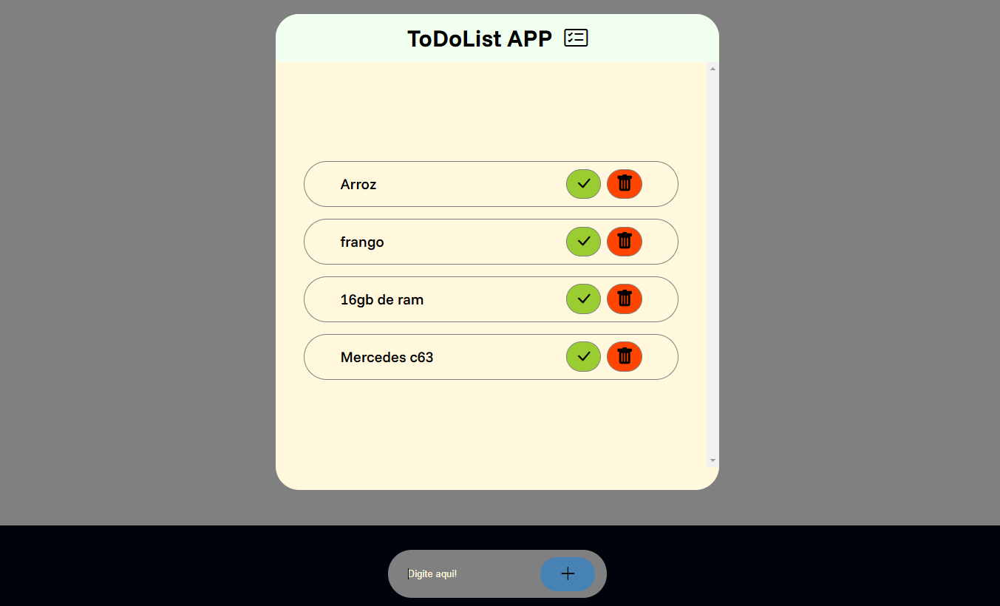

 

# todolist-wepage-v1

> Mais um dos meeu projetos para trreiar minhas habilidades com javascript, nesse projeto criei uma app de lista de afazeres com um botao para remover o item e outro para marcar o item como feito.

## Tecnologias

## Contribuir

1. **Clonar projeto:**: `git clone https://github.com/guicarbar/todolist-wepage-v1.git`
2. **Criar feature/branch:**: `git checkout -b feature/Nome-da-branch`

## Licença

Este projeto está sob a licença [MIT](LICENSE) License.